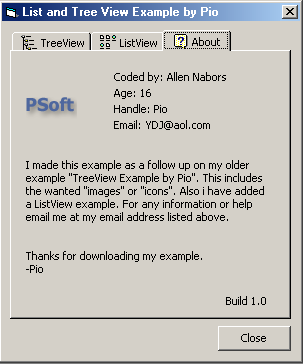



## List View & Tree View Example by Pio

### Description

This example will show you the basic ways to use a ListView or TreeView. Includes how to use pictures/icons.
 
### More Info
 

             |
---                |---
**Submitted On**   |2002-08-22 13:31:42
**By**             |[Pioneer](https://github.com/Planet-Source-Code/PSCIndex/blob/master/ByAuthor/pioneer.md)
**Level**          |Intermediate
**User Rating**    |4.8 (19 globes from 4 users)
**Compatibility**  |VB 5\.0, VB 6\.0
**Category**       |[Coding Standards](https://github.com/Planet-Source-Code/PSCIndex/blob/master/ByCategory/coding-standards__1-43.md)
**World**          |[Visual Basic](https://github.com/Planet-Source-Code/PSCIndex/blob/master/ByWorld/visual-basic.md)
**Archive File**   |[List\_View\_1212158222002\.zip](https://github.com/Planet-Source-Code/pioneer-list-view-tree-view-example-by-pio__1-38190/archive/master.zip)

